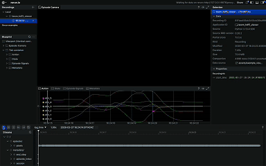

# LeRobot to LeWM HDF5 Pipeline

Dataset utilities for preparing [LeRobot](https://github.com/huggingface/lerobot) manipulation datasets for LeWM-style world-model training.

The initial goal of this project is to evaluate a LeWM / JEPA + SIGReg world-model approach on low-cost robotic manipulation data from the LeRobot ecosystem. The default source dataset is [`lerobot/koch_pick_place_1_lego`](https://huggingface.co/datasets/lerobot/koch_pick_place_1_lego). LeRobot datasets are convenient to distribute and replay as Parquet metadata plus MP4 videos, while intensive dynamics-model training benefits from a single HDF5 layout with direct random access to frames, actions, state vectors, episode metadata, and termination flags.

This repository currently focuses on that data bridge:

- download LeRobot datasets from Hugging Face into a local `datasets/raw/` tree;
- convert LeRobot Parquet/MP4 episodes into LeWM-compatible HDF5 files;
- validate episode integrity before and after conversion;
- inspect generated HDF5 schemas and shapes;
- visualize converted episodes with Rerun to verify that image streams and signals are aligned.

A converted HDF5 version of the default dataset is available on Hugging Face at [`Tpauwels/lerobot-hdf5-koch_pick_place_1_lego`](https://huggingface.co/datasets/Tpauwels/lerobot-hdf5-koch_pick_place_1_lego).

It does **not** currently include LeWM model training, CEM planning, MPC control, or Hugging Face upload automation for arbitrary converted HDF5 datasets.

## Why this exists

LeRobot is a strong format for robotics dataset distribution: tabular observations/actions are stored separately from encoded videos, and the official dataset API handles metadata, splits, video paths, and local caching.

For world-model training, especially when learning latent dynamics from large numbers of short temporal windows, the training loop often needs fast random access to synchronized samples. Architectures such as JEPA repeatedly sample heavy temporal windows across episodes, offsets, and camera streams. Doing that directly from MP4 videos plus Parquet metadata is inefficient at scale because it requires repeated video seeking, decoding, and cross-file synchronization. This project converts the LeRobot representation into one HDF5 file per split and camera, preserving the source episode structure while making random temporal-window sampling practical from a training dataloader.

This pipeline is specifically designed to facilitate the study of latent space stability when training on multi-view episodes (e.g., synchronized laptop and phone camera streams).

The conversion pipeline is intentionally strict by default. It fails on dirty episodes where terminal `done` flags are missing, early `done=True` values appear, or frame indices are not contiguous. These checks matter because a dynamics model should not silently learn from broken episode boundaries.

## Project status

Implemented:

- LeRobot dataset download script.
- LeRobot to HDF5 conversion script.
- Source episode pre-validation.
- HDF5 inspection and validation.
- Rerun episode visualization and `.rrd` export.
- Unit tests for conversion helpers, validation, and visualization path handling.

Not implemented in this repository yet:

- LeWM / JEPA model training.
- Goal embedding search.
- CEM or MPC inference loops.
- Robot deployment code.
- Upload/push automation for arbitrary converted HDF5 datasets.

## Repository layout

```text
.
├── assets/                      # Example visualization preview
├── lewm_dataset_utils/          # Shared validation and path helpers
├── scripts/
│   ├── download_lerobot_datasets.py
│   ├── convert_lerobot_to_hdf5.py
│   ├── inspect_validate_hdf5.py
│   └── visualize_hdf5_rerun.py
├── tests/                       # Unit tests
├── requirements.txt             # Minimal runtime dependencies
└── README.md
```

Generated datasets are written under `datasets/`, which is ignored by Git.

## Installation

Create a virtual environment and install the runtime dependencies:

```bash
python -m venv venv
source venv/bin/activate
pip install -r requirements.txt
```

Main runtime dependencies include `lerobot`, `h5py`, `numpy`, `av`, `opencv-python-headless`, `draccus`, and `rerun-sdk`.

## End-to-end workflow

### 1. Download a LeRobot dataset

Default dataset: [`lerobot/koch_pick_place_1_lego`](https://huggingface.co/datasets/lerobot/koch_pick_place_1_lego).

```bash
python scripts/download_lerobot_datasets.py
```

This downloads `lerobot/koch_pick_place_1_lego` into:

```text
datasets/raw/lerobot/koch_pick_place_1_lego/
```

Download one or more explicit repositories:

```bash
python scripts/download_lerobot_datasets.py \
  --repo_ids='["lerobot/koch_pick_place_1_lego","lerobot/koch_pick_place_5_lego"]'
```

Useful options:

```bash
python scripts/download_lerobot_datasets.py \
  --repo_ids='["lerobot/koch_pick_place_1_lego"]' \
  --download_videos=true \
  --force_cache_sync=false
```

### 2. Convert LeRobot Parquet/MP4 to HDF5

Default conversion:

```bash
python scripts/convert_lerobot_to_hdf5.py
```

Default input:

```text
datasets/raw/lerobot/koch_pick_place_1_lego/
```

Default output:

```text
datasets/hdf5/lerobot__koch_pick_place_1_lego/<split>__<camera>.h5
```

Example with a specific dataset, split, camera, resize, and overwrite:

```bash
python scripts/convert_lerobot_to_hdf5.py \
  --repo_id=lerobot/koch_pick_place_1_lego \
  --splits='["train"]' \
  --camera_keys='["observation.images.laptop"]' \
  --image_size=224 \
  --overwrite=true
```

The converter creates one HDF5 file per selected split/camera pair. For example:

```text
datasets/hdf5/lerobot__koch_pick_place_1_lego/train__observation_images_laptop.h5
```

The converted version of the default dataset is published at [`Tpauwels/lerobot-hdf5-koch_pick_place_1_lego`](https://huggingface.co/datasets/Tpauwels/lerobot-hdf5-koch_pick_place_1_lego).

### 3. Handle dirty episodes

By default, conversion runs in strict mode:

```text
require_terminal_done=true
dirty_episode_policy=fail
```

This means conversion stops if an episode does not terminate cleanly, contains an early `done=True`, or has non-contiguous step indices.

Drop invalid episodes instead of failing:

```bash
python scripts/convert_lerobot_to_hdf5.py \
  --dirty_episode_policy=drop
```

Warn but keep all episodes:

```bash
python scripts/convert_lerobot_to_hdf5.py \
  --dirty_episode_policy=warn
```

A machine-readable report is written to:

```text
datasets/hdf5/<repo_sanitized>/conversion_report.json
```

### 4. Tune decoding and memory behavior

The converter decodes videos linearly and writes HDF5 chunks in micro-batches. This is designed to stay stable on constrained machines.

Recommended stable defaults are already set:

```bash
python scripts/convert_lerobot_to_hdf5.py \
  --decode_backend=pyav \
  --micro_batch_size=64 \
  --stall_timeout_seconds=120
```

Supported decode backends:

```text
pyav
opencv
```

If the preferred backend cannot open a video, the converter attempts the other backend.

Supported compression modes:

```text
lzf    # default
none
gzip
```

Example using no compression:

```bash
python scripts/convert_lerobot_to_hdf5.py \
  --compression=none
```

## HDF5 output format

Each generated file stores synchronized per-step arrays for a single camera stream:

```text
pixels       uint8    shape: (num_steps, height, width, channels)
action       float32  shape: (num_steps, action_dim)
proprio      float32  shape: (num_steps, state_dim)
state        float32  shape: (num_steps, state_dim)
episode_idx  int64    shape: (num_steps,)
step_idx     int64    shape: (num_steps,)
done         bool     shape: (num_steps,)
timestamp    float32  shape: (num_steps,)
index        int64    shape: (num_steps,)
task_index   int64    shape: (num_steps,)
ep_len       int64    shape: (num_episodes,)
ep_offset    int64    shape: (num_episodes,)
```

The converter also writes HDF5 attributes:

```text
source_repo_id
source_split
source_camera_key
fps
generated_by
```

`ep_len` and `ep_offset` make episode slicing explicit. For episode `i`, rows are:

```python
start = ep_offset[i]
end = start + ep_len[i]
```

This layout is optimized for random access. A training loop can sample an arbitrary episode, temporal offset, and window length by slicing HDF5 rows directly instead of seeking into MP4 streams and rejoining video frames with Parquet rows at runtime. That access pattern is important for JEPA-style dynamics learning, where large batches of temporal transitions or multi-step windows are sampled repeatedly during training.

## Inspect and validate HDF5 files

Inspect schema, shapes, dtypes, episode count, and total step count:

```bash
python scripts/inspect_validate_hdf5.py \
  --mode=inspect \
  --target_path=datasets/hdf5/lerobot__koch_pick_place_1_lego
```

Validate converted files:

```bash
python scripts/inspect_validate_hdf5.py \
  --mode=validate \
  --target_path=datasets/hdf5/lerobot__koch_pick_place_1_lego
```

Validation checks include:

- required HDF5 keys are present;
- per-step arrays have consistent lengths;
- `pixels` is rank-4 with 1 or 3 channels;
- `ep_len` and `ep_offset` are consistent with total row count;
- each episode has contiguous `step_idx` values from `0` to `ep_len - 1`;
- terminal `done=True` is present when strict validation is enabled;
- no early `done=True` appears before the terminal step.

Write a JSON validation report:

```bash
python scripts/inspect_validate_hdf5.py \
  --mode=validate \
  --target_path=datasets/hdf5/lerobot__koch_pick_place_1_lego \
  --output_json=artifacts/hdf5_validation.json
```

## Visualize an episode with Rerun

The Rerun viewer is used as a conversion sanity check: it displays the camera stream, action dimensions, state dimensions, `done`, `step_idx`, `episode_idx`, and session metadata on the `step` timeline.



Open an HDF5 file directly:

```bash
python scripts/visualize_hdf5_rerun.py \
  --target_path=datasets/hdf5/lerobot__koch_pick_place_1_lego/train__observation_images_laptop.h5 \
  --episode_index=0
```

Resolve a file from a directory by split and camera:

```bash
python scripts/visualize_hdf5_rerun.py \
  --target_path=datasets/hdf5/lerobot__koch_pick_place_1_lego \
  --split=train \
  --camera_key=observation.images.laptop \
  --episode_index=3
```

Visualize only a step window:

```bash
python scripts/visualize_hdf5_rerun.py \
  --target_path=datasets/hdf5/lerobot__koch_pick_place_1_lego/train__observation_images_laptop.h5 \
  --episode_index=0 \
  --start_step=10 \
  --end_step=80 \
  --step_stride=2
```

Save a `.rrd` recording without opening the GUI:

```bash
python scripts/visualize_hdf5_rerun.py \
  --target_path=datasets/hdf5/lerobot__koch_pick_place_1_lego/train__observation_images_laptop.h5 \
  --episode_index=0 \
  --spawn_viewer=false \
  --save_rrd=true \
  --rrd_path=artifacts/train_laptop_ep0.rrd
```

## Minimal Python read example

```python
from pathlib import Path

import h5py

path = Path("datasets/hdf5/lerobot__koch_pick_place_1_lego/train__observation_images_laptop.h5")

with h5py.File(path, "r") as h5f:
    episode = 0
    start = int(h5f["ep_offset"][episode])
    length = int(h5f["ep_len"][episode])
    end = start + length

    frames = h5f["pixels"][start:end]
    actions = h5f["action"][start:end]
    states = h5f["state"][start:end]
    done = h5f["done"][start:end]

    print(frames.shape, actions.shape, states.shape, done[-1])
```

## Run tests

```bash
python -m unittest discover -s tests
```

The tests cover:

- source episode validation behavior;
- HDF5 validation behavior;
- conversion helper logic and video backend fallback;
- Rerun visualization path resolution and episode logging helpers.
